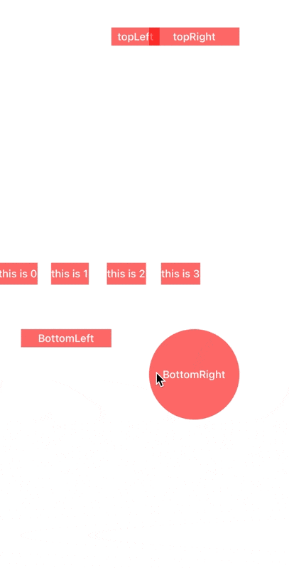

# Marker

Light, convenient, and qualified guidance prompts.

[简体中文](README_CN.md)

# Preview



# Features

- Simple. 

Simple code, simple use, simple configuration.

- No calculation.

No calculation required (calculation of relative position, etc.)

- Decorationable.
 
Can be used as a decorative view, no event in response. (hitTest:) always return nil.

- Global.
 
Global style configure, global instance by identifier, global dismiss all marker instance.

- Strong guidance.

Only respond event on tap marker range.

Needs to set options: `[.strongGuidance]`.

Default is weak guidance: tap anywhere to respond event(show next).


# Codes

### Marker.Info

`Marker.Info` is a structure used to describe how `Marker` displays.

```swift
Marker.Info(
    // Marked view
    marker: UIView?,
    
    // `String` or `NSAttributedString`
    intro: Any?, 
    
    styles: [Marker.Info.Style] = [],
    options: [Options] = [],
    
    // Completed this time
    completion: CompletionBlock? = nil
)


styles: [Marker.Info.Style]: [
    // hide triangle arrow
    .hideArrow,
    
    // color of intro
    .color(Color),
    
    // triangle arrow display position
    .arrowPosition(ArrowPosition),
    
    // dimming background frame
    .dimFrame(CGRect),
    
    // highlight range expanded
    .highlightRangeExpande(CGFloat),
    
    .timeout(TimeInterval),
    .maxWidth(CGFloat),
    .cornerStyle(CornerStyle)
]

options: [Options]: [
    // Strong guidance. It means that only tap on the highlighted range will respond.
    // Default is weak guidance: tap anywhere to continue(next).
    .strongGuidance,
    
    // Will not repond any tap events.
    // ⚠️ Need to be used with `strongGuidance`.
    .eventPenetration,
    
    // It means that only display on view, no event repond.
    // It will set dimFrame to `.zero`.
    .decoration
]
```


### Global Style Configuration

`Marker.default`, see `Marker+Appearence.swift`

Can configure: `maxWidth`, `color`, `spacing`, `padding`, `textFont`, `textColor`, `showArrow`...

## Example

### Normal

```swift
let info = Marker.Info(
    marker: settingsButton, 
    intro: "Tap here enter to settings.",
    styles: [
        .dimFrame(.zero)
    ],
    options: [.decoration],
    completion: { (markerInstance: Marker, isTriggerByUser: Bool) in
        print("marker of enter settings dismiss with user: \(isTriggerByUser)")
    }
)

let profile = Marker.Info(
    marker: profileButton, 
    intro: "Tap here to edit your profile."
)
Marker(info)
    .nexts([profile])
    .show(
        on: self.view,
        completion: { (markerInstance: Marker, isTriggerByUser: Bool) in 
            print("marker of enter to settings and profile are all of dismiss")
        }
    )
```

### Strong guidance

#### \#1

Only respond event(show next) on tap highlight range.
```swift
Marker.Info(... options: [.strongGuidance])
```

#### \#2

Pass event to next hitTest view on tap highlight range.
```swift
Marker.Info(... options: [.strongGuidance, .eventPenetration])
```

### Global

```swift
// show
Marker(info, identifier: "settings-marked").show(on: self.view)

// Dismiss specify marker
Marker.instance(from: "settings-marked")?.dismiss()

// Dismiss all marker
Marker.dismiss(triggerByUser: <#Bool#>)
```

## Install

#### Swift Package Manager

```swift
.package(url: "https://github.com/iWECon/Marker", from: "3.0.0")
```
